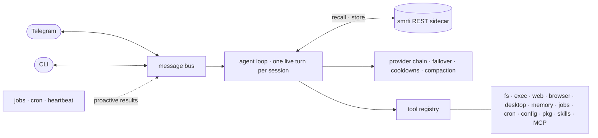

<!-- Plain  on purpose: the GitHub mobile app does not render
     <picture>/<source>, it drops the element and shows a broken-image icon.
     The src is an absolute raw URL for the same reason: the mobile app does
     not resolve repo-relative image paths either. -->

<p align="center">
  
</p>

<h1 align="center">Factor</h1>

<p align="center">
  <a href="https://github.com/cyqlelabs/factor/actions/workflows/ci.yml"></a>
  <a href="https://github.com/cyqlelabs/factor/actions/workflows/ci.yml"></a>
  <a href="https://pkg.go.dev/github.com/cyqlelabs/factor"></a>
  <a href="https://github.com/cyqlelabs/factor/releases/latest"></a>
  <a href="LICENSE"></a>
</p>

**A fast, reliable, lightweight desktop AI agent and companion — with a real memory.**

Factor is a single static Go binary that lives on your machine, talks to you over the
CLI or Telegram, does real work with real tools, and remembers what matters across
conversations. Its long-term memory is [smrti](https://github.com/cyqlelabs/smrti) —
Bayesian truth values, attention economics, emotional valence — so Factor doesn't
just log what you said: it consolidates, prioritizes, and *never repeats a critical
mistake*.

## Highlights

| | |
|---|---|
| 🧠 **Memory as the soul** | Salience-ranked recall every turn; past failures become hard constraints; consolidation decays, promotes, and prunes — plus deliberate `remember` / `recall` / `forget` / `reflect` tools |
| ⚡ **Never keeps you waiting** | Long work runs as background jobs — Factor acks instantly and proactively messages you when the result lands, even mid-conversation |
| 🎯 **Mid-turn steering** | A second message during a live turn is injected between tool iterations instead of queuing |
| 🔁 **Provider failover that works** | OpenAI-compatible (OpenRouter, Ollama, LM Studio, Groq, llama.cpp, …) and native Anthropic, with error classification, per-candidate cooldowns, and overflow-triggered compaction |
| 🧭 **Reasoning, dialect-translated** | One `provider.reasoning` setting becomes `reasoning` (OpenRouter), `reasoning_effort` (OpenAI/Groq), or a `thinking` budget (Anthropic) |
| 🖐️ **Hands on your desktop** | Windows, screenshots, mouse, keyboard, clipboard, notifications — X11, Wayland, macOS, Windows; auto-registered when a display exists |
| 🌐 **A real browser, not just fetch** | CDP tools attach to your running Chrome/Chromium/Brave or launch a managed instance — visible by default so you can watch it work |
| 🧩 **Extensible everything** | Channel connectors, Go tools, runtime-mounted MCP servers, markdown skills, drop-in instructions — see [Extending](#extending-factor) |
| 🔧 **Self-managing** | Edits its own config, installs packages (apt/dnf/pip/npm/…), runs cron schedules and `HEARTBEAT.md` checks that cost zero LLM calls when idle |
| 🛡️ **Safety rails** | Workspace-restricted files, exec deny-patterns, sender allowlists, secrets scrubbed from every tool result — rails, not a sandbox ([Security](#security-model)) |

## How it works



Bus + bounded workers, mid-turn steering, narrow pluggable seams, CGO-free
portability — the architecture of [PicoClaw](https://github.com/sipeed/picoclaw)
distilled into a codebase that runs happily on an old Puppy Linux box.

## Get started

```bash
go install github.com/cyqlelabs/factor/cmd/factor@latest
# or grab a release binary; linux-amd64 targets GOAMD64=v1 (no SSE4.2 needed)

factor init      # interactive setup wizard
```

The wizard verifies every step live — the provider with a real completion, the
model picked from the endpoint's live list, the Telegram token with `getMe` — and
installs smrti if it's missing (`uv` → `pipx` → `pip --user` → private venv; no
root needed). `factor init -y` takes the defaults for scripting; `--no-install`
keeps it from installing anything.

```bash
export FACTOR_PROVIDER_API_KEY=sk-or-...   # OpenRouter by default
factor                                     # interactive chat
factor -m "what's on my disk?"             # one-shot
factor gateway                             # daemon: Telegram, cron, heartbeat, jobs
factor status                              # daemon / provider / memory health
```

Factor spawns and supervises the smrti sidecar automatically, restarts it with
backoff, and degrades gracefully (empty recalls, dropped writes) when it's down.
Point `memory.mode: "external"` + `memory.url` at a shared smrti if you run one.

## Configuration

`~/.factor/config.json` — every key optional, defaults work. `FACTOR_*` env
overrides: `FACTOR_PROVIDER_API_KEY`, `FACTOR_PROVIDER_MODEL`, `FACTOR_MEMORY_MODE`, …

<details>
<summary><b>Annotated example</b></summary>

```jsonc
{
  "provider": {
    "type": "openrouter",                    // openrouter|openai|groq|ollama|lmstudio|llamacpp|anthropic|custom
    "api_key": "sk-or-...",
    "model": "google/gemini-3.1-pro-preview",
    "reasoning": { "effort": "xhigh" },      // or {"max_tokens": 12000}; "none" turns it off
    "fallbacks": [{ "type": "ollama", "model": "qwen3:8b" }]
  },
  "memory": {
    "mode": "sidecar",                       // sidecar | external | off
    "auto_install": true,                    // install smrti when it is missing
    "personality": "balanced",               // analytical | curious | empathetic | maverick | deterministic
    "space": "main"
  },
  "channels": {
    "telegram": { "token": "123:ABC", "allow_from": ["your-telegram-id"] }
  },
  "mcp": {
    "servers": { "github": { "command": "github-mcp-server", "args": ["stdio"] } }
  },
  "tools": { "disabled": [], "restrict_to_workspace": true },
  "desktop": { "enabled": null },            // null = on when a display exists
  "browser": { "enabled": true, "headless": false },
  "heartbeat": { "enabled": true, "interval_minutes": 30 }
}
```

</details>

The workspace (`~/.factor/workspace`) is the agent's home: `AGENT.md`, `SOUL.md`,
`USER.md` shape its identity; `HEARTBEAT.md` lists proactive tasks; `instructions/`,
`skills/`, `sessions/`, `cron/` do what they say.

## Extending Factor

| Seam | What it takes |
|---|---|
| **Connector** | One package: `channel.Register(name, factory)` in `init()`, with its own config section |
| **Tool** | Four methods — `Name`, `Description`, `Parameters`, `Execute` — and one `registry.Register(t)` line |
| **MCP server** | `mcp_add` (or the `mcp.servers` config section) mounts its tools at runtime — no Go required |
| **Skill** | Drop `workspace/skills/<name>/SKILL.md` — catalog in prompt, full text on demand, `skill_install` from git |

<details>
<summary><b>Wiring in a connector</b></summary>

```go
func init() {
    channel.Register("mychat", func(raw json.RawMessage, b *bus.MessageBus) (channel.Channel, error) {
        var cfg MyConfig
        _ = json.Unmarshal(raw, &cfg)          // your own config section
        return New(cfg, b), nil                // implement Name/Start/Stop/Send/MaxMessageLength
    })
}
```

</details>

## Security model

Factor is a personal agent, not a multi-tenant service. The guardrails (workspace
restriction, exec deny-patterns, allowlists, secret redaction) protect against
accidents and casual prompt-injection — they are **not** a security boundary. Run it
under your own account for yourself; set `channels.telegram.allow_from`; keep
`restrict_to_workspace` on unless you know why you're turning it off.

## Development

```bash
make check        # gofmt + vet + race tests + coverage gate (≥90%, what CI runs)
make build        # local binary
make build-all    # release cross-compile (incl. GOAMD64=v1 for old x86-64)
make build-tiny   # -tags nobrowser: smallest binary
```

The suite runs against fakes — scripted providers, a fake smrti sidecar (spawned
by re-execing the test binary), a fake Telegram API, a fake MCP server over real
stdio JSON-RPC, a scripted desktop — plus live headless-Chrome and desktop
round-trip tests that auto-skip where the machine can't host them.

## License

MIT © CyqleLabs
