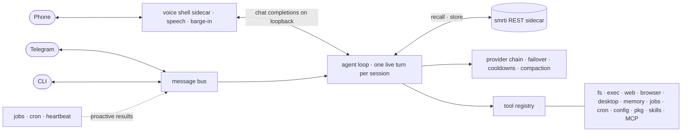
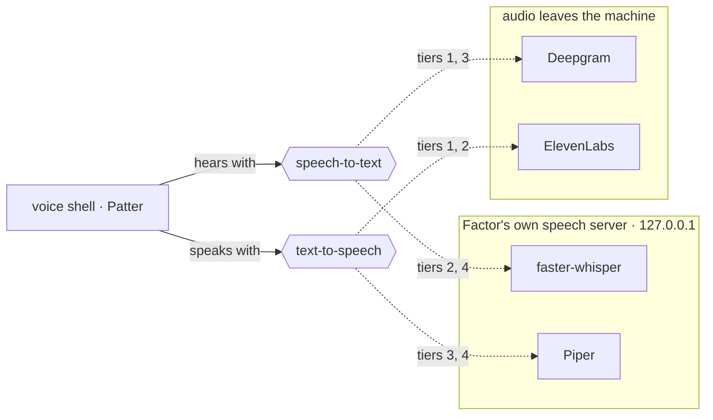

<!-- Plain  on purpose: the GitHub mobile app does not render
     <picture>/<source>, it drops the element and shows a broken-image icon.
     The src is an absolute raw URL for the same reason: the mobile app does
     not resolve repo-relative image paths either. -->

<p align="center">
  
</p>

<h1 align="center">Factor</h1>

<p align="center">
  <a href="https://github.com/cyqlelabs/factor/actions/workflows/ci.yml"></a>
  <a href="https://github.com/cyqlelabs/factor/actions/workflows/ci.yml"></a>
  <a href="https://pkg.go.dev/github.com/cyqlelabs/factor"></a>
  <a href="https://github.com/cyqlelabs/factor/releases/latest"></a>
  <a href="LICENSE"></a>
</p>

**A fast, lightweight AI agent that lives on your machine — with hands on your
desktop, a voice on the phone, and a real memory.**

Factor is a single static Go binary. Chat with it in the terminal, message it on
Telegram, or call its phone number and talk out loud: the same agent picks up every
time, with the same tools and the same memory. It drives a real browser, works your
desktop, keeps long tasks running in the background, and calls or texts you when one
lands. Its long-term memory is [smrti](https://github.com/cyqlelabs/smrti) — Bayesian
truth values, attention economics, emotional valence — so Factor doesn't just log
what you said: it consolidates, prioritizes, and *never repeats a critical mistake*.

## Highlights

| | |
|---|---|
| 🧠 **Memory as the soul** | Salience-ranked recall every turn; past failures become hard constraints; consolidation decays, promotes, and prunes — plus deliberate `remember` / `recall` / `forget` / `reflect` tools |
| ⚡ **Never keeps you waiting** | Long work runs as background jobs — Factor acks instantly and proactively messages you when the result lands, even mid-conversation |
| 🎯 **Mid-turn steering** | A second message during a live turn is injected between tool iterations instead of queuing |
| 🔁 **Provider failover that works** | OpenAI-compatible (OpenRouter, Ollama, LM Studio, Groq, llama.cpp, …) and native Anthropic, with error classification, per-candidate cooldowns, and overflow-triggered compaction |
| 🧭 **Reasoning, dialect-translated** | One `provider.reasoning` setting becomes `reasoning` (OpenRouter), `reasoning_effort` (OpenAI/Groq), or a `thinking` budget (Anthropic) |
| ☎️ **Answers the phone** | A real number: call it and talk to Factor out loud, or have it call and text you — barge-in, voicemail detection, and a fully local speech tier if you want no audio leaving the machine ([Phone](#phone-calls-and-sms)) |
| 🖐️ **Hands on your desktop** | Windows, screenshots, mouse, keyboard, clipboard, notifications — X11, Wayland, macOS, Windows; auto-registered when a display exists — plus **grid vision**: a vision model sees the screen under a coordinate grid, zooms a cell, and clicks it by name ([Desktop](#desktop)) |
| 🌐 **A real browser, not just fetch** | CDP tools attach to your running Chrome/Chromium/Brave or launch a managed instance, visible by default so you can watch it work — and setup installs one when the machine has none ([Browser](#browser)) |
| 🧩 **Extensible everything** | Channel connectors, Go tools, runtime-mounted MCP servers, markdown skills, drop-in instructions — see [Extending](#extending-factor) |
| 🔧 **Self-managing** | Edits its own config, installs packages (apt/dnf/pip/npm/…), upgrades and restarts itself into the newest release, runs cron schedules and `HEARTBEAT.md` checks that cost zero LLM calls when idle |
| 🛡️ **Safety rails** | Workspace-restricted files, exec deny-patterns, sender allowlists, secrets scrubbed from every tool result — rails, not a sandbox ([Security](#security-model)) |

## How it works



Bus + bounded workers, mid-turn steering, narrow pluggable seams, CGO-free
portability — the architecture of [PicoClaw](https://github.com/sipeed/picoclaw)
distilled into a codebase that runs happily on an old Puppy Linux box.

## Get started

```bash
go install github.com/cyqlelabs/factor/cmd/factor@latest
# or grab a release binary; linux-amd64 targets GOAMD64=v1 (no SSE4.2 needed)

factor init      # interactive setup wizard
```

The wizard verifies every step live: the provider with a real completion, the model
picked from the endpoint's live list, the Telegram token with `getMe`, the carrier
and voice credentials against their own APIs, the browser with a real page load.
Then it installs what's missing instead of handing you a list — smrti (`uv` →
`pipx` → `pip --user` → private venv, no root needed), a browser, the helpers your
desktop backend wants. It looks for that desktop on the machine rather than in this
shell, so `factor init` over ssh still sets up the desktop the box is running.
`factor init -y` takes the defaults for scripting; `--no-install` keeps it from
installing anything.

```bash
export FACTOR_PROVIDER_API_KEY=sk-or-...   # OpenRouter by default
factor                                     # interactive chat
factor -m "what's on my disk?"             # one-shot
factor gateway                             # daemon: Telegram, phone, cron, heartbeat, jobs
factor status                              # daemon / provider / memory / phone / desktop health
factor upgrade                             # replace this binary with the newest release
```

Factor spawns and supervises the smrti sidecar automatically, restarts it with
backoff, and degrades gracefully (empty recalls, dropped writes) when it's down.
Point `memory.mode: "external"` + `memory.url` at a shared smrti if you run one.

`factor upgrade` downloads the release built for this machine, checks it against the
published `SHA256SUMS`, and swaps the binary in place; `--check` only reports what's
out. A running gateway then restarts itself into the new binary — once it has
finished answering, and without changing pid, so systemd never sees it stop. It
looks for releases once a day and tells you in whichever chat you last used, but
never installs behind your back. Asking Factor to upgrade itself is the same path:
it installs, says goodbye, and is back a few seconds later.

## Configuration

`~/.factor/config.json` — every key optional, defaults work. `FACTOR_*` env
overrides: `FACTOR_PROVIDER_API_KEY`, `FACTOR_PROVIDER_MODEL`, `FACTOR_MEMORY_MODE`, …

<details>
<summary><b>Annotated example</b></summary>

```jsonc
{
  "provider": {
    "type": "openrouter",                    // openrouter|openai|groq|ollama|lmstudio|llamacpp|anthropic|custom
    "api_key": "sk-or-...",
    "model": "google/gemini-3.1-pro-preview",
    "reasoning": { "effort": "xhigh" },      // or {"max_tokens": 12000}; "none" turns it off
    "fallbacks": [{ "type": "ollama", "model": "qwen3:8b" }]
  },
  "memory": {
    "mode": "sidecar",                       // sidecar | external | off
    "auto_install": true,                    // install smrti when it is missing
    "personality": "balanced",               // analytical | curious | empathetic | maverick | deterministic
    "space": "main"
  },
  "channels": {
    "telegram": { "token": "123:ABC", "allow_from": ["your-telegram-id"] },
    "phone": {                                 // optional; absent = nothing runs
      "user_number": "+15550001111",           // you: the only one who may call in
      "phone_number": "+15550002222",          // the number you bought
      "carrier": "twilio",                     // twilio | telnyx
      "twilio_account_sid": "AC...",           // twilio: these two
      "twilio_auth_token": "...",
      // telnyx instead: "telnyx_api_key", "telnyx_connection_id", "telnyx_public_key"
      "elevenlabs_api_key": "...",
      "stt_api_key": "...",                    // Deepgram
      "language": "en",
      "stt": { "provider": "deepgram" },       // deepgram | whisper | local-openai
      "tts": { "provider": "elevenlabs" },     // elevenlabs | local-openai
      "proactive": "sms",                      // sms | call | off
      "max_call_minutes": 15
    }
  },
  "mcp": {
    "servers": { "github": { "command": "github-mcp-server", "args": ["stdio"] } }
  },
  "tools": { "disabled": [], "restrict_to_workspace": true },
  "desktop": { "enabled": null },            // null = on when a display exists
  "browser": {
    "enabled": true,
    "command": "",                           // "" = find one; init records what it installed
    "headless": false,
    "fast_path": false                       // opt in to the lightweight read-only engine
  },
  "heartbeat": { "enabled": true, "interval_minutes": 30 },
  "upgrade": { "check": true, "check_interval_hours": 24 }   // report new releases; never install one unasked
}
```

</details>

The workspace (`~/.factor/workspace`) is the agent's home: `AGENT.md`, `SOUL.md`,
`USER.md` shape its identity; `HEARTBEAT.md` lists proactive tasks; `instructions/`,
`skills/`, `sessions/`, `cron/` do what they say.

## Browser

Factor drives a real browser over DevTools: it attaches to your running
Chrome/Chromium/Brave, or launches a managed instance that stays visible so you can
watch it work. A machine with no browser gets one — `factor init` installs
[Helium](https://helium.computer) under `~/.factor/engine`, from a portable tarball
that needs no package manager and no root. Helium is ungoogled-chromium with the
telemetry stripped, the anti-fingerprinting patches in, and uBlock Origin bundled,
which is what actually keeps a tab's memory down on a small box.

Reading a page and driving a page cost wildly different amounts, so you can add a
second engine for the cheap half:

| Engine | Tools | Renders | Good for |
|---|---|---|---|
| **Chromium** — Helium, or the browser you already run | `browser_navigate` · `_read` · `_click` · `_fill` · `_screenshot` · `_eval` · `_back` | yes | anything interactive |
| **Lightpanda** — opt-in, `browser.fast_path` | `browser_fetch` — title, text, links | never | reading a page for a fraction of the memory |

Lightpanda runs the same JavaScript against a DOM and never starts a renderer, a GPU
process, or a compositor. It cannot click, fill, or screenshot and it keeps no
session, so it supplements the real browser instead of replacing it — the agent
picks whichever the job needs. The wizard offers it only where it runs: its builds
need glibc 2.34, and the check happens before the 150 MB download, not after.

## Desktop

Factor works the graphical session through the desktop's own helper programs
(xdotool, wmctrl, scrot and friends on X11; grim/wtype on Wayland; osascript on
macOS; PowerShell on Windows) — no CGO bindings, so the binary stays static and the
tools cost nothing on a headless box, where they simply don't register.

On top of the plain window/mouse/keyboard/clipboard tools sits **grid vision**, a
two-pass pointing loop for vision-capable models:

1. `screen_view` captures the screen and attaches it with a battleship coordinate
   grid overlaid — columns A, B, C…, rows 1, 2, 3… The model doesn't guess pixel
   coordinates (which vision models are famously bad at); it names the cell it can
   see: "the icon is in D4".
2. `screen_zoom cell=D4` magnifies that cell (or any pixel region, e.g. a window's
   geometry from `window_list`) under a finer sub-grid, taking precision from
   ~cell-size down to ~10px in one more look.
3. `mouse action=click cell=B3` clicks the named cell's center — cells resolve back
   to native screen pixels automatically, on either view.

Everything is pure Go image math: no OpenCV, no OCR models, no extra helpers beyond
the screenshot program already required. Frames sent to the model are capped at
1568px on the longest side (clicks still land at native resolution), only the two
newest frames stay in context, and image bytes never touch session history — so a
long desktop session stays cheap in tokens and in disk, which is the point on a
small box. Non-vision models can keep the rest of the desktop suite and disable the
two vision tools via `tools.disabled`.

## Phone calls and SMS

Give Factor a phone number and it picks up: you talk, it answers out loud, with the
same memory, tools, and session history it has everywhere else. It can also call or
text *you* — a finished job, a cron result, or because you asked it to ring someone
and report back.

```bash
factor init        # the Channels step walks through the carrier and the speech tier
factor gateway     # brings the line up
factor status      # number, speech tier, voice-shell health
```

The voice shell is [Patter](https://github.com/PatterAI/Patter) running as a
supervised sidecar — exactly like the smrti memory engine, into its own virtualenv,
installed on demand. It terminates the carrier's media stream and owns the parts of
a phone call that are hard: turn-taking, barge-in, voice activity detection,
answering-machine detection, transcoding. Factor is its brain, plugged in over
loopback as an OpenAI-compatible endpoint that never leaves `127.0.0.1`.

**Speech tiers** — the one decision with real trade-offs, asked plainly by the wizard:

| Tier | Speech-to-text | Text-to-speech | Extra RAM | When |
|---|---|---|---|---|
| **1 · cloud** (default) | Deepgram nova-3 | ElevenLabs flash v2.5 (µ-law 8 kHz, no transcode) | ~150–300 MB | any machine; lowest latency, least to go wrong |
| **2 · local STT** | faster-whisper | ElevenLabs | +0.5–2 GB | transcription stays home; wants a GPU |
| **3 · local TTS** | Deepgram | Piper | +0.3 GB | Piper's ~100 ms render beats the cloud, on any CPU |
| **4 · fully local** | faster-whisper | Piper | +1–2 GB | no audio leaves the machine, no per-minute audio cost |

A tier picks who serves each half of the speech pipeline. Everything else is the same call:



**Pick a local tier and Factor installs it.** The engines go into their own
virtualenv and your language's models download before setup finishes — so the first
call finds everything on disk. No server to start, no model names to choose.
`factor status` reports what it built.

**Languages.** Transcription covers everything Whisper does, about 99 languages.
Voices come from Piper's catalogue: **49 languages**, resolved from your `language`
setting. The exact locale wins where it exists — `es-MX` gets a Mexican voice, not a
Castilian one — then the language at large. Spanish is first-class on every tier.

<details>
<summary><b>Why a GPU changes which tier to pick</b></summary>

Whisper decodes a fixed 30-second window however little audio it gets, and the phone
pipeline feeds it about a second at a time. Cost is therefore per chunk, not per
second of speech. Measured on this design:

| Model | Device | Per 1 s chunk | Verdict |
|---|---|---|---|
| `small` | CUDA | ~0.14 s | keeps up comfortably |
| `base` | CPU | ~0.9 s | keeps up, mishears more |
| `small` | CPU | ~2.4 s | falls behind; the backlog grows while you talk |

So local transcription runs `small` on a GPU and drops to `base` on a CPU, and the
wizard says so when it does. **On a machine with no GPU, tier 3 is the better
trade**: Piper renders in ~100 ms on any CPU, and transcription stays in the cloud.

</details>

You can still point `stt.base_url` / `tts.base_url` at a speech server you run
yourself — [Speaches](https://github.com/speaches-ai/speaches), or anything else
OpenAI-compatible — and Factor will leave it alone and use it. Either way it probes
at startup. If the server is not answering, Factor falls back to the cloud tier and
says so rather than failing calls; set `local_audio_fallback: false` to have the
channel report itself down instead. Silero voice-activity detection runs locally in
every tier.

Roughly $0.04–0.06 per talk-minute on tier 1 plus your model's tokens, and about
1.3¢ per SMS segment. Turns are not streamed yet, so a tool-using turn leans on the
spoken filler while it works; simple questions land in the normal 1.5–3 s range.

<details>
<summary><b>Getting the line up, and the guardrails on it</b></summary>

Buy a number at Twilio or Telnyx, then run `factor init`. The wizard asks which one,
takes the credentials it needs, and verifies them — along with the voice key — live
before writing anything.

| | Twilio | Telnyx |
|---|---|---|
| Credentials | account SID + auth token | API key + connection id + public key |
| Setup at the carrier | buy a number | buy a number, create a Call Control Application |
| Cost | the baseline above | lower per minute and per text |

The connection id is that application's. On every start Factor attaches the number to
it and points its webhook at wherever the shell is answering, so a rotating tunnel
keeps working and there is nothing to click in the portal. Telnyx signs its webhooks
and the shell refuses ones it cannot verify, which is why the public key is required
rather than optional.

The carrier has to reach the voice shell, so it needs a public URL. `tunnel: "quick"`
(the default) uses Patter's built-in Cloudflare quick tunnel — fine for trying it
out, **not** for daily use: the hostname rotates and first legs occasionally drop.
For real use set `tunnel: "none"` and a stable `webhook_url` from a named tunnel or
a reverse proxy. Factor's own endpoints — the brain bridge and the shell's control
API — always bind `127.0.0.1` and share a bearer secret regenerated every boot.

Because a phone number is dialable by anyone and a phone call costs money, the rails
are closed by default: only `user_number` may call in (add more with `allow_from`, or
`"*"` for anyone, which logs a security warning), only `user_number` may be dialed
(add more with `allow_call_to` — there is deliberately no wildcard), calls are cut
off at `max_call_minutes`, and call transfer is off. A caller who is not allowed is
hung up at the carrier *and* refused by the bridge.

Two tools appear only when the channel is configured: `phone_sms` sends a text, and
`phone_call` dials — returning immediately, then reporting the outcome (answered,
no answer, busy, voicemail) with a transcript tail back into whichever conversation
asked for the call.

</details>

## Extending Factor

| Seam | What it takes |
|---|---|
| **Connector** | One package: `channel.Register(name, factory)` in `init()`, with its own config section |
| **Tool** | Four methods — `Name`, `Description`, `Parameters`, `Execute` — and one `registry.Register(t)` line |
| **MCP server** | `mcp_add` (or the `mcp.servers` config section) mounts its tools at runtime — no Go required |
| **Skill** | Drop `workspace/skills/<name>/SKILL.md` — catalog in prompt, full text on demand, `skill_install` from git |

<details>
<summary><b>Wiring in a connector</b></summary>

```go
func init() {
    channel.Register("mychat", func(raw json.RawMessage, b *bus.MessageBus) (channel.Channel, error) {
        var cfg MyConfig
        _ = json.Unmarshal(raw, &cfg)          // your own config section
        return New(cfg, b), nil                // implement Name/Start/Stop/Send/MaxMessageLength
    })
}
```

</details>

## Security model

Factor is a personal agent, not a multi-tenant service. The guardrails (workspace
restriction, exec deny-patterns, allowlists, secret redaction) protect against
accidents and casual prompt-injection — they are **not** a security boundary. Run it
under your own account for yourself; set `channels.telegram.allow_from`; keep
`restrict_to_workspace` on unless you know why you're turning it off. The phone
channel is the one place where the default is *closed* rather than open — a number
anyone can dial, and a bill attached to every minute, earn stricter rails.

## Development

```bash
make check        # gofmt + vet + race tests + coverage gate (≥90%, what CI runs)
make build        # local binary
make build-all    # release cross-compile (incl. GOAMD64=v1 for old x86-64)
make build-tiny   # -tags nobrowser: smallest binary
```

The suite runs against fakes — scripted providers, a fake smrti sidecar and a fake
voice shell (both spawned by re-execing the test binary), a fake Telegram API, a
fake carrier, a fake MCP server over real stdio JSON-RPC, a scripted desktop — plus
live headless-Chrome and desktop round-trip tests that auto-skip where the machine
can't host them.

## License

MIT © CyqleLabs
