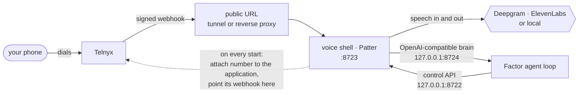

# Phone setup — Telnyx

Everything it takes to make Factor answer a Telnyx number: what to create in the
portal, what `factor init` asks, and how to tell whether the line is really up.
[Twilio](phone-twilio.md) is the other carrier — a little less setup, a little
more per minute.

## What you need

| | Where | Skip it if |
|---|---|---|
| A number with Voice (and SMS, for texts) | [portal.telnyx.com](https://portal.telnyx.com) → Numbers | — |
| A Call Control Application, and its connection id | Voice → Call Control Applications | — |
| API key **and** public key | Auth → API Keys | — |
| Deepgram API key | [console.deepgram.com](https://console.deepgram.com) | you pick a local speech-to-text tier |
| ElevenLabs API key | [elevenlabs.io](https://elevenlabs.io) | you pick a local text-to-speech tier |

The gateway has to be running to pick up, so this wants a machine that stays on.

## At Telnyx

1. **Buy a number** with Voice enabled.
2. **Create a Call Control Application** under Voice. Leave its webhook URL
   empty — Factor sets it on every start. Copy the application's id; that is the
   `connection_id`.
3. **Copy both keys** from Auth → API Keys: the V2 API key, and the public key
   on the same page.
4. **For SMS only:** assign the number to a messaging profile. Factor attaches
   the number to the Call Control Application itself, but it does not touch
   messaging.

The public key is not optional. Telnyx signs its webhooks, the voice shell
refuses ones it cannot verify, and Factor's config validation rejects the
section outright rather than letting every call fail at the carrier.

## In Factor

```bash
factor init     # Channels step → "Set up phone calls and SMS?" → Telnyx
```

The wizard reads the Call Control Application back before accepting anything,
which proves both credentials at once: a bad key is rejected, and a connection
id belonging to some other account is not found. It prints the application name
on success and refuses an inactive one. Then it asks for the public key, the
number you bought, your own number, the language, the [speech
tier](../README.md#phone-calls-and-sms), the voice keys, and what Factor should
do when it needs you and you are not in a chat.

What lands in `~/.factor/config.json`:

```json
"channels": {
  "phone": {
    "carrier": "telnyx",
    "phone_number": "+15550002222",
    "user_number": "+15550001111",
    "telnyx_api_key": "KEY…",
    "telnyx_connection_id": "…",
    "telnyx_public_key": "…",
    "stt_api_key": "<deepgram>",
    "elevenlabs_api_key": "…",
    "language": "en"
  }
}
```

The rest defaults: `stt.provider` deepgram, `tts.provider` elevenlabs,
`proactive` sms, `max_call_minutes` 15, `tunnel` quick, control port 8722,
bridge port 8724. Both numbers must be E.164 (`+15550001234`) or the channel
refuses to start.

## Bring the line up

```bash
factor gateway     # first start builds ~/.factor/voice-venv and installs Patter
factor status      # number, speech tier, voice-shell health
```

Patter needs Python 3.11 or newer and installs itself into its own virtualenv;
the first start therefore takes a minute. The `phone:` line of `factor status`
should then say `voice shell healthy`. Call the number from `user_number` — Factor greets you as
soon as it picks up, because silence on answer reads as a dropped call.

## How a call gets to the agent



Patter auto-configures Twilio and never Telnyx, so Factor does that part itself.
On every start, once the public hostname is known, it PATCHes the number's
`connection_id` to your application and sets the application's
`webhook_event_url` to wherever the shell is answering. A rotating tunnel keeps
working and there is nothing to click in the portal.

A number already assigned in the portal is left working either way: the attach
call failing is logged, not fatal.

Beyond that, Patter terminates the media stream and owns turn-taking, barge-in
and voice activity detection; Factor is only the brain on the other end of
loopback, with the same memory, tools and sessions it has in every other
channel. ElevenLabs renders linear PCM at 16 kHz for Telnyx, so nothing
transcodes on the way out.

## Make the public URL stable

`tunnel: "quick"` — the default — uses Patter's built-in Cloudflare quick
tunnel. It is fine for a first call and **not** fine for daily use: the hostname
rotates and first legs occasionally drop.

For real use, put the shell behind a named tunnel or a reverse proxy and point
Factor at it:

```json
"tunnel": "none",
"webhook_url": "https://factor.example.com"
```

The proxy has to reach the webhook port, which is `sidecar_port + 1` (8723 by
default); the carrier path is `/webhooks/telnyx/voice`. Factor's own endpoints —
the brain bridge and the shell's control API — always bind `127.0.0.1` and share
a bearer secret regenerated every boot.

## The rails

A phone number is dialable by anyone and a call costs money, so everything is
closed until you open it: only `user_number` can call in (`allow_from` adds
more, `"*"` opens the line to everyone and logs a security warning), only
`user_number` can be dialed (`allow_call_to` adds more; there is deliberately no
wildcard), and calls are cut off at `max_call_minutes`. A caller who is not
allowed is hung up at the carrier *and* refused by the bridge.

Two tools appear once the channel is configured: `phone_sms` sends a text, and
`phone_call` dials and reports back — answered, no answer, busy or voicemail —
with a transcript tail, into whichever conversation asked for the call.

## When it does not work

`~/.factor/logs/voiceshell.log` is the voice shell's own log, and the first
place to look. It says `telnyx webhook set` with the URL once the carrier has
been pointed at this process.

| Symptom | Usually | Fix |
|---|---|---|
| Startup refuses the section over `telnyx_public_key` | the key is missing | copy it from Auth → API Keys; without it the shell rejects every webhook |
| `factor status` says the voice shell is not answering | the gateway is not running, or Patter is still installing | start `factor gateway`, watch the log |
| The number rings but Factor never picks up | the webhook never got set — the log will say so | check the API key can write to the application, or set `webhook_url` by hand in the portal |
| The log says it could not attach the number | the number is assigned to another connection on purpose | assign it to the Call Control Application in the portal |
| Your call is refused or hung up immediately | the caller is not on the allowlist | check `user_number` and `allow_from` |
| Factor picks up but never speaks | no ElevenLabs key, or a local speech server that is not answering | `factor status` names the tier; the log says when it fell back to the cloud |
| Texts are rejected | the number has no messaging profile | assign one in the portal |
| Startup complains about `phone_number` or `user_number` | not E.164 | write them as `+15550001234` |
| `getpatter` will not install | Python older than 3.11 | install a newer Python, or set `channels.phone.command` to one |
