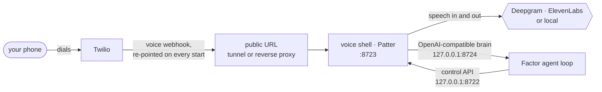

# Phone setup — Twilio

Everything it takes to make Factor answer a Twilio number: what to click in the
portal, what `factor init` asks, and how to tell whether the line is really up.
[Telnyx](phone-telnyx.md) is the other carrier — cheaper per minute, a little
more setup.

## What you need

| | Where | Skip it if |
|---|---|---|
| A number with Voice (and SMS, for texts) | [console.twilio.com](https://console.twilio.com) → Phone Numbers | — |
| Account SID and auth token | the console home page | — |
| Deepgram API key | [console.deepgram.com](https://console.deepgram.com) | you pick a local speech-to-text tier |
| ElevenLabs API key | [elevenlabs.io](https://elevenlabs.io) | you pick a local text-to-speech tier |

The gateway has to be running to pick up, so this wants a machine that stays on.

## At Twilio

Buy the number, copy the account SID and auth token. That is the whole portal
side.

Leave the number's voice webhook alone: Patter rewrites it every time the voice
shell starts, which is what lets the public URL move between restarts.

**On a trial account** Twilio only connects to numbers you have verified. Add
your own under Verified Caller IDs first, or every test call and text is
rejected before Factor ever sees it.

## In Factor

```bash
factor init     # Channels step → "Set up phone calls and SMS?" → Twilio
```

The wizard asks for the SID and token and reads the account back from Twilio
before accepting them — it prints the account name on success and refuses a
suspended account. Then it asks for the number you bought, your own number, the
language, the [speech tier](../README.md#phone-calls-and-sms), the voice keys,
and what Factor should do when it needs you and you are not in a chat. Nothing
is written until it all verifies.

What lands in `~/.factor/config.json`:

```json
"channels": {
  "phone": {
    "carrier": "twilio",
    "phone_number": "+15550002222",
    "user_number": "+15550001111",
    "twilio_account_sid": "AC…",
    "twilio_auth_token": "…",
    "stt_api_key": "<deepgram>",
    "elevenlabs_api_key": "…",
    "language": "en"
  }
}
```

The rest defaults: `stt.provider` deepgram, `tts.provider` elevenlabs,
`proactive` sms, `max_call_minutes` 15, `tunnel` quick, control port 8722,
bridge port 8724. Both numbers must be E.164 (`+15550001234`) or the channel
refuses to start.

## Bring the line up

```bash
factor gateway     # first start builds ~/.factor/voice-venv and installs Patter
factor status      # number, speech tier, voice-shell health
```

Patter needs Python 3.11 or newer and installs itself into its own virtualenv;
the first start therefore takes a minute. The `phone:` line of `factor status`
should then say `voice shell healthy`. Call the number from `user_number` — Factor greets you as
soon as it picks up, because silence on answer reads as a dropped call.

## How a call gets to the agent



Patter terminates the media stream and owns turn-taking, barge-in and voice
activity detection. Factor is only the brain on the other end of loopback, with
the same memory, tools and sessions it has in every other channel. ElevenLabs
renders µ-law at 8 kHz for Twilio, so nothing transcodes on the way out.

## Make the public URL stable

`tunnel: "quick"` — the default — uses Patter's built-in Cloudflare quick
tunnel. It is fine for a first call and **not** fine for daily use: the hostname
rotates and first legs occasionally drop.

For real use, put the shell behind a named tunnel or a reverse proxy and point
Factor at it:

```json
"tunnel": "none",
"webhook_url": "https://factor.example.com"
```

The proxy has to reach the webhook port, which is `sidecar_port + 1` (8723 by
default). Factor's own endpoints — the brain bridge and the shell's control API
— always bind `127.0.0.1` and share a bearer secret regenerated every boot.

## The rails

A phone number is dialable by anyone and a call costs money, so everything is
closed until you open it: only `user_number` can call in (`allow_from` adds
more, `"*"` opens the line to everyone and logs a security warning), only
`user_number` can be dialed (`allow_call_to` adds more; there is deliberately no
wildcard), and calls are cut off at `max_call_minutes`. A caller who is not
allowed is hung up at the carrier *and* refused by the bridge.

Two tools appear once the channel is configured: `phone_sms` sends a text, and
`phone_call` dials and reports back — answered, no answer, busy or voicemail —
with a transcript tail, into whichever conversation asked for the call.

## When it does not work

`~/.factor/logs/voiceshell.log` is the voice shell's own log, and the first
place to look.

| Symptom | Usually | Fix |
|---|---|---|
| `factor status` says the voice shell is not answering | the gateway is not running, or Patter is still installing | start `factor gateway`, watch the log |
| The number rings, then Twilio plays an error | the webhook points at a tunnel hostname that has since rotated | restart the gateway, or move to `tunnel: "none"` with a stable `webhook_url` |
| Your call is refused or hung up immediately | the caller is not on the allowlist, or a trial account with an unverified caller id | check `user_number` / `allow_from`, and Verified Caller IDs at Twilio |
| Factor picks up but never speaks | no ElevenLabs key, or a local speech server that is not answering | `factor status` names the tier; the log says when it fell back to the cloud |
| Texts never arrive | the number has no SMS capability, or trial restrictions | check the number's capabilities in the console |
| Startup complains about `phone_number` or `user_number` | not E.164 | write them as `+15550001234` |
| `getpatter` will not install | Python older than 3.11 | install a newer Python, or set `channels.phone.command` to one |
